# AWS Retail ETL Pipeline

An event-driven serverless ETL pipeline on AWS that automatically transforms retail sales data when a CSV is uploaded to S3. Built manually through the AWS Management Console, then codified with CloudFormation and automated with GitHub Actions.

**Flow:** `S3 upload → Lambda → Glue Workflow → Input Crawler → Python Shell ETL → Output Crawler → Glue Catalog → Athena`

---

## Table of contents

- [Architecture](#architecture)
- [Tech stack](#tech-stack)
- [Repository structure](#repository-structure)
- [The transformation](#the-transformation)
- [Implementation walkthrough](#implementation-walkthrough)
- [CI/CD with GitHub Actions](#cicd-with-github-actions)
- [Infrastructure as Code](#infrastructure-as-code-cloudformation)
- [IAM and least privilege](#iam-and-least-privilege)
- [Cost management](#cost-management)
- [Cleanup](#cleanup)

---

## Architecture

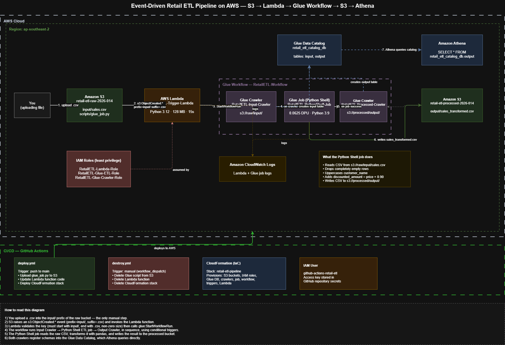

### How it works

1. A `.csv` file is uploaded to the `input/` prefix of the raw S3 bucket — the only manual step.
2. S3 raises an `s3:ObjectCreated:*` event (filtered on `prefix=input/`, `suffix=.csv`) and invokes the Lambda function.
3. Lambda validates the object key (must start with `input/`, end with `.csv`, and be non-zero size), then calls `glue:StartWorkflowRun`.
4. The Glue Workflow runs three steps in sequence using conditional triggers: Input Crawler → Python Shell ETL job → Output Crawler.
5. The Python Shell job reads the raw CSV with pandas, applies the transformation, and writes the result back to the processed bucket.
6. Both crawlers register schemas into the Glue Data Catalog, which Athena queries directly with standard SQL.

---

## Tech stack

| Service | Purpose |
|---|---|
| Amazon S3 | Raw input storage, processed output storage, Glue script hosting |
| AWS Lambda | Event listener — validates the upload and starts the workflow |
| AWS Glue Workflow | Orchestrates crawlers and the ETL job with conditional triggers |
| AWS Glue Crawlers | Infer schema from S3 and register tables in the Data Catalog |
| AWS Glue Python Shell | Lightweight pandas-based transformation (0.0625 DPU) |
| AWS Glue Data Catalog | Central metadata store for `input` and `output` tables |
| Amazon Athena | Serverless SQL validation of the transformed data |
| Amazon CloudWatch | Logs for Lambda and Glue job runs |
| AWS CloudFormation | Infrastructure as Code for the entire stack |
| GitHub Actions | CI/CD — automated deploy and destroy pipelines |

---

## Repository structure

```
aws-retail-etl-pipeline/
├── .github/
│   └── workflows/
│       ├── deploy.yml               # CI/CD deploy pipeline
│       └── destroy.yml              # CI/CD teardown pipeline
├── architecture/
│   ├── retail-etl-architecture.png  # Architecture diagram
│   └── retail-etl-architecture.drawio
├── cloudformation/
│   └── retail-etl-pipeline.yaml     # IaC template for all resources
├── glue/
│   └── glue_job.py                  # Python Shell transformation script
├── lambda/
│   └── lambda_function.py           # S3 event handler
├── screenshots/                     # Evidence of successful runs
├── sales.csv                        # Sample input data
└── README.md
```

---

## The transformation

The Glue Python Shell job performs four operations on the input CSV:

1. Drops completely empty rows
2. Uppercases the `customer_name` column
3. Adds a `discounted_amount` column = `price × 0.90`, rounded to 2 decimals
4. Writes the result as CSV to the processed bucket via `boto3.put_object`

**Input** (`s3://retail-etl-raw-2026-014/input/sales.csv`):

```csv
order_id,customer_name,product,category,quantity,price
1001,Rahul,Laptop,Electronics,1,55000
1002,Priya,Mouse,Electronics,2,750
1003,Arun,Keyboard,Electronics,1,1200
1004,Neha,Monitor,Electronics,2,15000
1005,Ravi,Chair,Furniture,1,8500
```

**Output** (`s3://retail-etl-processed-2026-014/output/sales_transformed.csv`):

```csv
order_id,customer_name,product,category,quantity,price,discounted_amount
1001,RAHUL,Laptop,Electronics,1,55000,49500.0
1002,PRIYA,Mouse,Electronics,2,750,675.0
1003,ARUN,Keyboard,Electronics,1,1200,1080.0
1004,NEHA,Monitor,Electronics,2,15000,13500.0
1005,RAVI,Chair,Furniture,1,8500,7650.0
```

Python Shell was chosen over Spark because the dataset is small — a 1/16 DPU Python Shell job starts in seconds and costs a fraction of a Spark job, with pandas providing everything the transformation needs.

---

## Implementation walkthrough

The pipeline was built manually through the AWS Management Console first, verified end to end, and only then codified into CloudFormation.

### 1. S3 buckets

Two buckets with ACLs disabled (bucket owner enforced), all public access blocked, and SSE-S3 encryption enabled.

| Bucket | Prefix | Contents |
|---|---|---|
| `retail-etl-raw-2026-014` | `input/` | `sales.csv` |
| `retail-etl-raw-2026-014` | `scripts/` | `glue_job.py` |
| `retail-etl-processed-2026-014` | `output/` | `sales_transformed.csv` |

### 2. Glue Data Catalog database

A database named `retail_etl_catalog_db` holds the `input` and `output` tables that the crawlers populate.

### 3. Input Crawler

Crawls `s3://retail-etl-raw-2026-014/input/` and creates the `input` table.


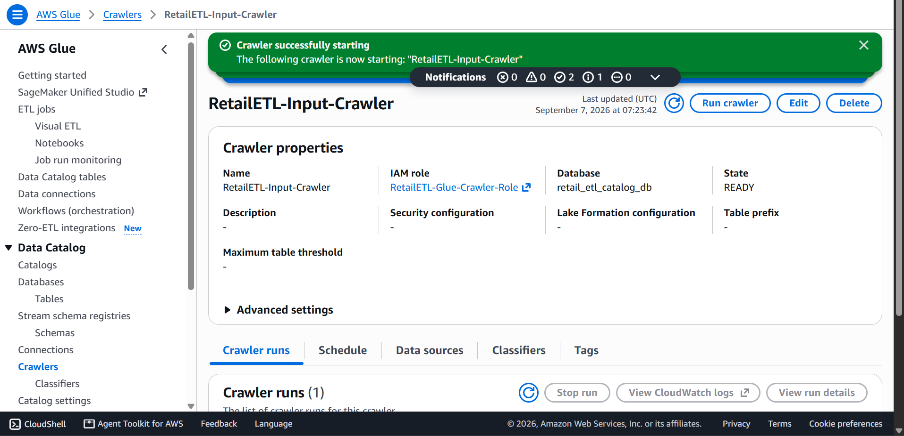

The resulting catalog table with the inferred schema:

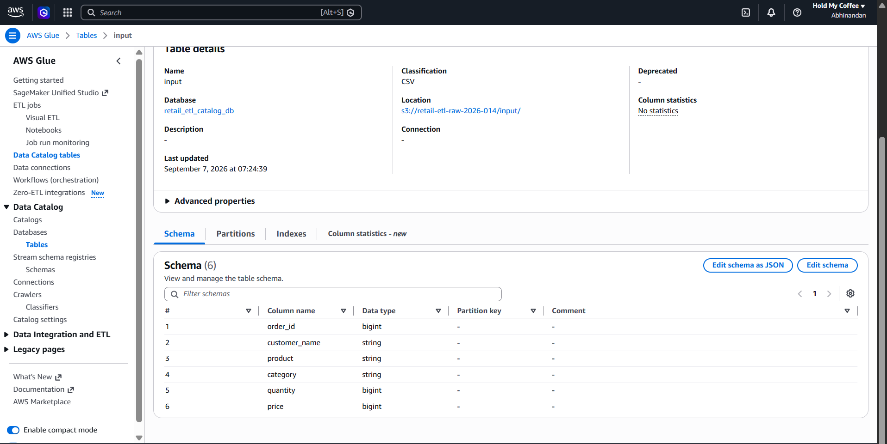

### 4. Glue Python Shell ETL job

The core transformation. Created via **Script editor → Python Shell**, not Visual ETL.

| Setting | Value |
|---|---|
| Name | `RetailETL-PythonShell-Job` |
| Type | Python Shell |
| Python version | 3.9 (with `analytics` library set for pandas) |
| IAM role | `RetailETL-Glue-ETL-Role` |
| Data processing units | 1/16 DPU (0.0625) |
| Retries | 0 |
| Script location | `s3://retail-etl-raw-2026-014/scripts/glue_job.py` |

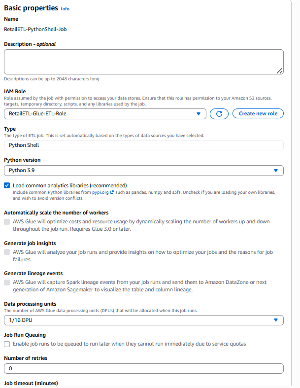

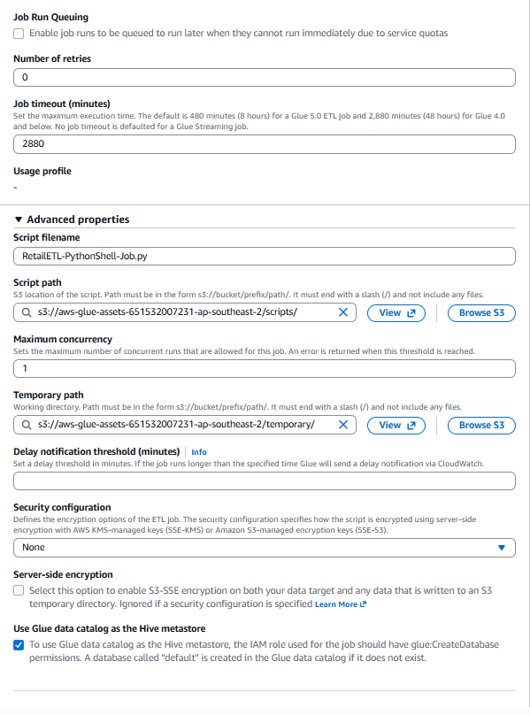

Input and output paths are passed as job parameters rather than hardcoded in the script:

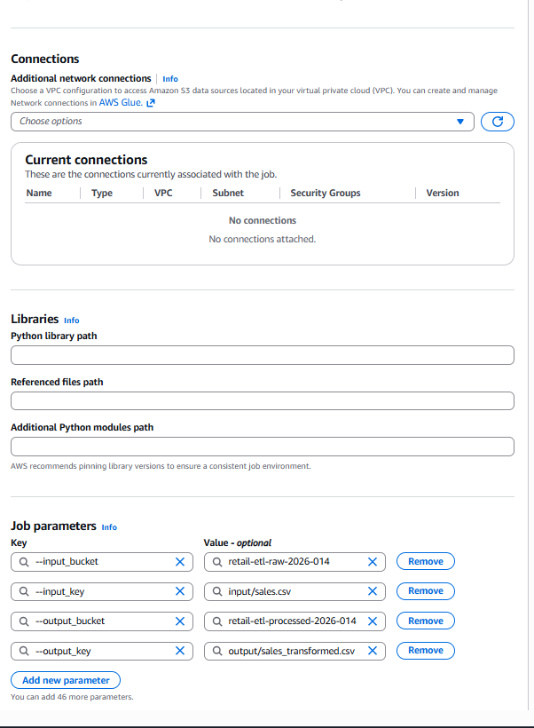

> **Note:** Python Shell jobs do not auto-inject `--JOB_NAME` the way Spark jobs do. Because the script calls `getResolvedOptions` with `JOB_NAME` in its argument list, `--JOB_NAME` must be added explicitly as a job parameter or the job fails with `error: the following arguments are required: --JOB_NAME`.

A successful run:

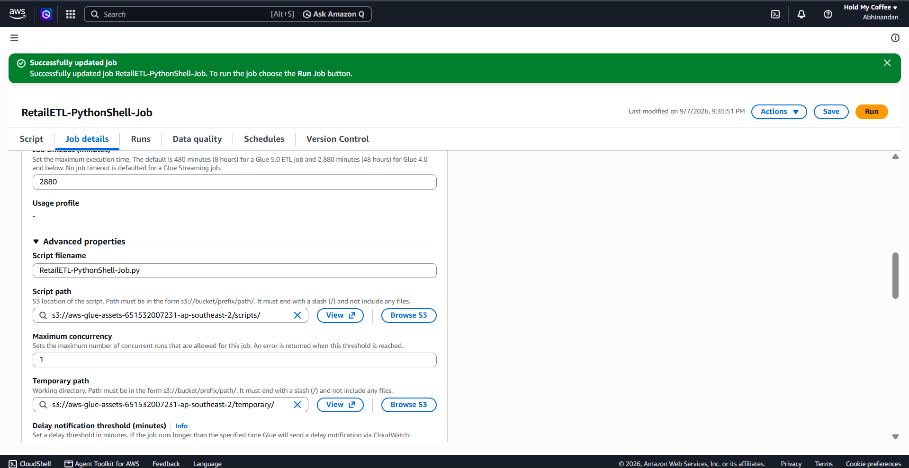

The transformed output landing in the processed bucket:

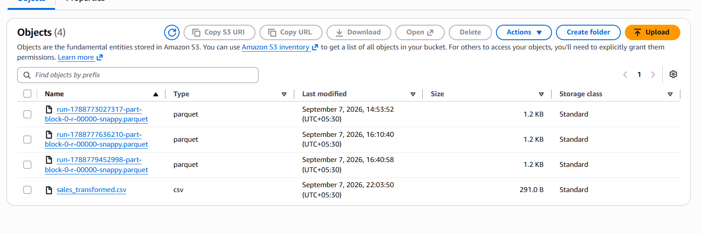

### 5. Output Crawler

Crawls `s3://retail-etl-processed-2026-014/output/` and creates the `output` table.

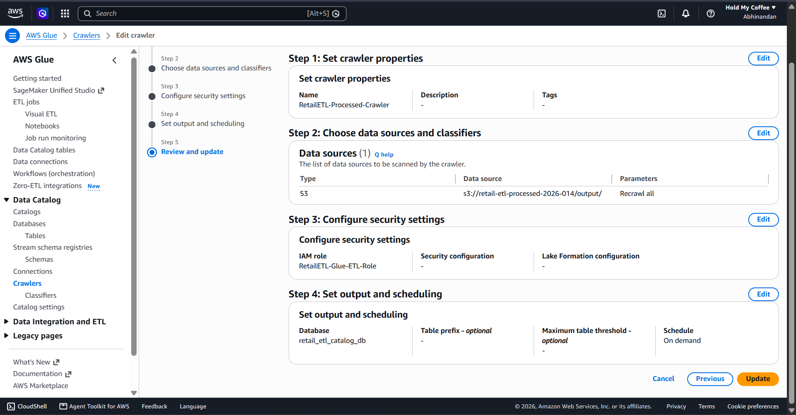

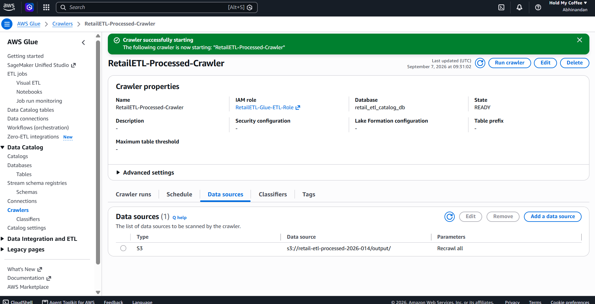

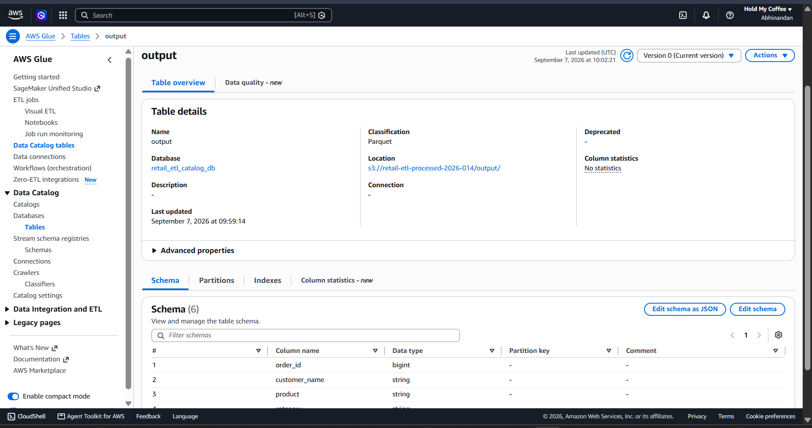

### 6. Glue Workflow

The workflow chains everything together with conditional triggers, so each step only fires when the previous one succeeds.

```
Start
  └─> RetailETL-Input-Crawler
        └─> PythonShellStart-Trigger  (fires on crawler SUCCEEDED)
              └─> RetailETL-PythonShell-Job
                    └─> OutputCrawler-Trigger  (fires on job SUCCEEDED)
                          └─> RetailETL-Processed-Crawler
```

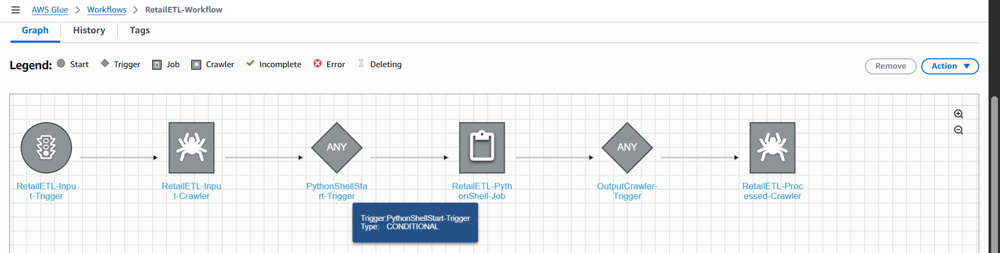

### 7. Lambda trigger

`RetailETL-Trigger-Lambda` (Python 3.12, 128 MB, 15s timeout) receives the S3 event and starts the workflow. It filters out anything that isn't a non-empty CSV under `input/`:

```python
if not key.startswith('input/'):        continue
if not key.lower().endswith('.csv'):    continue
if size == 0:                           continue
glue.start_workflow_run(Name=WORKFLOW_NAME)
```

Lambda starts the **workflow**, not the job directly. This is the key enhancement over the original demo — orchestration lives in Glue, so crawlers and the ETL job stay in sync without Lambda needing to know about them.

### 8. S3 event notification

Configured on the raw bucket:

| Setting | Value |
|---|---|
| Event type | `s3:ObjectCreated:*` |
| Prefix | `input/` |
| Suffix | `.csv` |
| Destination | `RetailETL-Trigger-Lambda` |

### 9. Athena validation

Confirms the full pipeline produced queryable, correctly transformed data:

```sql
SELECT * FROM retail_etl_catalog_db.output LIMIT 10;
```

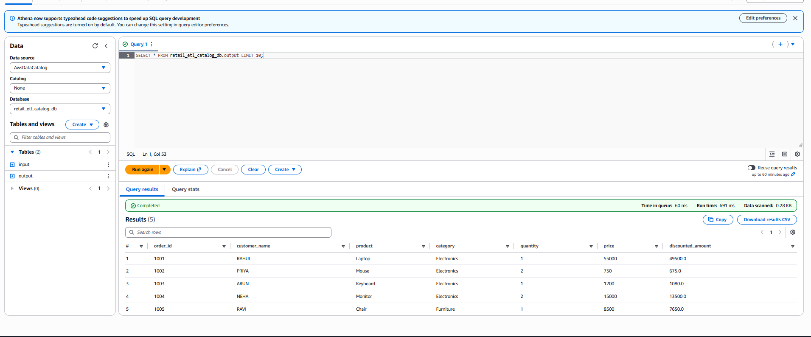

Five rows returned, `customer_name` uppercased, `discounted_amount` correctly calculated at 90% of `price`.

---

## CI/CD with GitHub Actions

Two workflows automate deployment and teardown.

### `deploy.yml` — runs on every push to `main`

1. Uploads `glue/glue_job.py` to the S3 scripts prefix
2. Zips and pushes `lambda/lambda_function.py` to the Lambda function
3. Deploys the CloudFormation stack

### `destroy.yml` — manual trigger (`workflow_dispatch`)

Removes the Glue script, deletes the Lambda function, and tears down the CloudFormation stack.

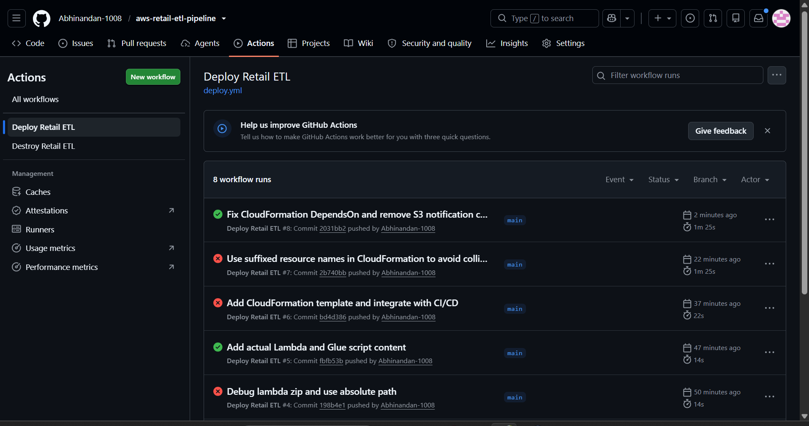

### Required repository secrets

| Secret | Description |
|---|---|
| `AWS_ACCESS_KEY_ID` | Access key for the `github-actions-retail-etl` IAM user |
| `AWS_SECRET_ACCESS_KEY` | Corresponding secret key |
| `AWS_REGION` | `ap-southeast-2` |

---

## Infrastructure as Code (CloudFormation)

`cloudformation/retail-etl-pipeline.yaml` provisions the complete stack:

- 2 S3 buckets (encrypted, public access blocked)
- 3 IAM roles with scoped inline policies
- 1 Glue Data Catalog database
- 2 Glue crawlers
- 1 Glue Python Shell job
- 1 Glue Workflow with 3 triggers
- 1 Lambda function with an S3 invoke permission

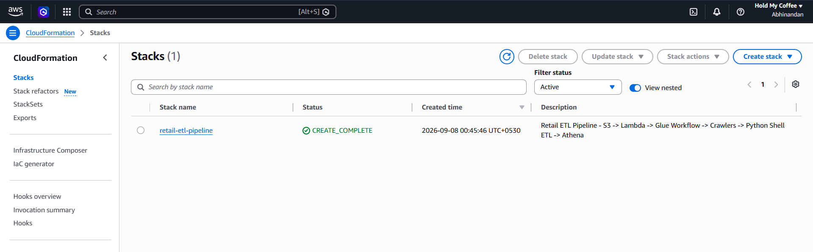

```bash
aws cloudformation deploy \
  --template-file cloudformation/retail-etl-pipeline.yaml \
  --stack-name retail-etl-pipeline \
  --capabilities CAPABILITY_NAMED_IAM \
  --no-fail-on-empty-changeset
```

### Design notes

**Resource naming.** The CloudFormation resources use a `-CFN` suffix so the stack can be deployed alongside the manually built pipeline without name collisions. AWS returns a `ResourceExistenceCheck` failure if a template tries to create a resource that already exists.

**No S3 notification in the template.** Defining the `NotificationConfiguration` on the bucket while the Lambda it points to is created in the same stack produces a circular dependency. The notification is configured separately; `DependsOn` handles the remaining ordering between roles, buckets, jobs, and triggers.

---

## IAM and least privilege

Three roles, each scoped to only what it needs. No `AdministratorAccess` anywhere.

### `RetailETL-Lambda-Role`

Trusts `lambda.amazonaws.com`. Can start exactly one workflow and write to exactly one log group:

```json
{
  "Version": "2012-10-17",
  "Statement": [
    {
      "Sid": "StartSpecificGlueWorkflow",
      "Effect": "Allow",
      "Action": "glue:StartWorkflowRun",
      "Resource": "arn:aws:glue:ap-southeast-2:<account-id>:workflow/RetailETL-Workflow"
    },
    {
      "Sid": "WriteLambdaLogs",
      "Effect": "Allow",
      "Action": ["logs:CreateLogStream", "logs:PutLogEvents"],
      "Resource": "arn:aws:logs:ap-southeast-2:<account-id>:log-group:/aws/lambda/RetailETL-Trigger-Lambda:*"
    }
  ]
}
```

Resource ARNs are case-sensitive. A policy written against `retail-etl-workflow` will not match a workflow named `RetailETL-Workflow`.

### `RetailETL-Glue-ETL-Role`

Trusts `glue.amazonaws.com`. Reads from the raw bucket, writes to the processed bucket, reads the Data Catalog, and writes job logs.

### `RetailETL-Glue-Crawler-Role`

Trusts `glue.amazonaws.com`. Reads both buckets and manages Data Catalog tables and partitions.

---

## Cost management

The assignment requires a billing alarm. Billing preferences are restricted in this account:

> This feature is only available in enterprise AWS. In order to access certain features you have to transition to enterprise AWS.

In an account with billing access, the alarm would be configured as:

1. **Billing → Billing preferences** — enable *Receive CloudWatch billing alerts*
2. **CloudWatch (us-east-1) → Alarms → Create alarm**
3. Metric: **Billing → Total Estimated Charge → EstimatedCharges (USD)**
4. Condition: Static, Greater than, `10`
5. Notification: new SNS topic `RetailETL-BillingAlert` with an email subscription
6. Confirm the SNS subscription from the email

Billing metrics only exist in `us-east-1`, regardless of where the workload runs.

Cost is kept low by design: Python Shell at 1/16 DPU instead of a Spark job, on-demand crawlers rather than scheduled ones, and serverless components that idle at zero.

---

## Cleanup

To avoid ongoing charges, tear down in this order:

1. Run the **Destroy Retail ETL** workflow from the GitHub Actions tab
2. Delete the CloudFormation stack if any resources remain
3. Empty and delete both S3 buckets (a bucket must be empty before it can be deleted)
4. Delete the Glue Data Catalog database, crawlers, job, and workflow if created outside CloudFormation
5. Delete the Lambda function and its CloudWatch log group
6. Delete the `github-actions-retail-etl` IAM user access key

Capture all screenshots before deleting anything — the evidence in this repository cannot be regenerated once the resources are gone.

---

## Troubleshooting notes

Issues encountered during the build and how they were resolved.

| Error | Cause | Fix |
|---|---|---|
| `error: the following arguments are required: --JOB_NAME` | Python Shell jobs don't auto-inject `JOB_NAME` | Add `--JOB_NAME` as an explicit job parameter |
| `KeyError: 'amount'` | Script column names didn't match the actual CSV headers | Map the transformation to the real columns (`price`, not `amount`) |
| `HIVE_BAD_DATA: Malformed Parquet file` in Athena | Catalog table still pointed at leftover Parquet from an earlier test | Delete the stale Parquet objects and re-run the output crawler |
| `Uploaded file must be a non-empty zip` | The Lambda source file was empty (0 bytes) | Write the actual code to the file before zipping |
| `AccessDeniedException` on `glue:StartWorkflowRun` | Policy ARN case didn't match the real resource name | Correct the ARN casing in the role policy |
| `ResourceExistenceCheck` failed on stack create | Template tried to create resources that already existed manually | Suffix the CloudFormation resource names |

---

## Author

Abhinandan — AWS Data Engineering Bootcamp 2026
